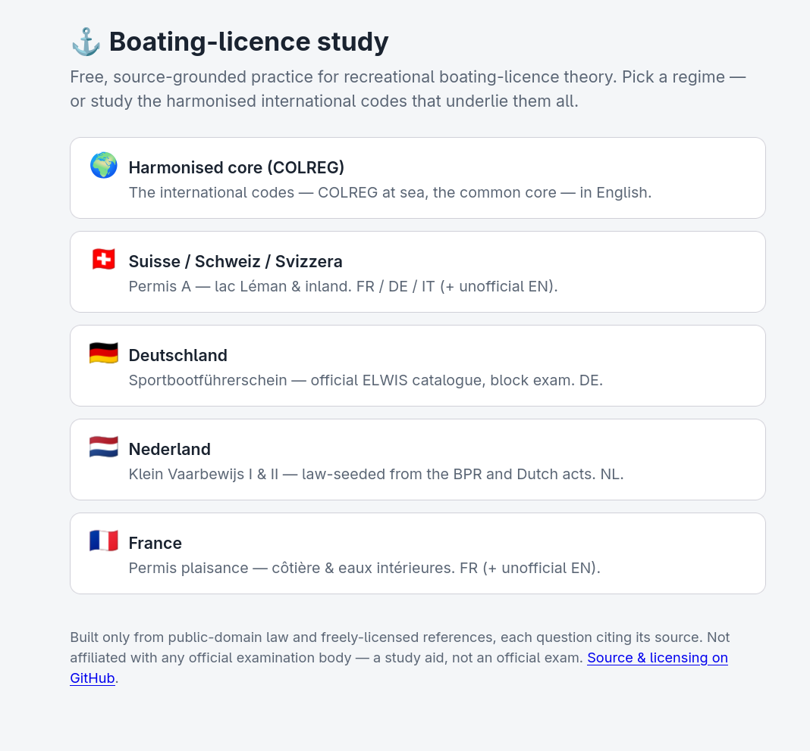

# Boating-licence — leer de vaarregels uit geverifieerde bronnen

**Talen:** [English](README.md) · [Français](README.fr.md) · [Deutsch](README.de.md) · [Italiano](README.it.md) · **Nederlands**

<p align="center"></p>

Een open raamwerk voor het studeren van **nationale theorie-examens voor het
vaarbewijs**, gebouwd **uitsluitend** uit wetgeving in het publieke domein en
referenties die duidelijk herbruikbaar zijn. Het dekt vandaag vier landen —
**🇫🇷 Frankrijk · 🇩🇪 Duitsland · 🇨🇭 Zwitserland · 🇳🇱 Nederland** — achter één
pipeline en één player, en het is zo ontworpen dat een land toevoegen één nieuw
bestand is, geen fork.

Voor elk land levert het drie dingen:

1. een gestructureerde, geversioneerde **kennisbank** (KB) afgeleid van het recht
   van dat land,
2. een **oefenvragenbank met bronvermelding**, en
3. een afhankelijkheidsvrije **statische player** (browser / GitHub Pages) met
   **Anki**- en **Moodle GIFT**-exports.

## De juridische grens (de kern van de zaak)

Bij elk officieel examen hoort een vragenbank, en de betaalde oefen-apps verpakken
die opnieuw. Dit project raakt **niets daarvan** aan. De harde regel, in elk land
hetzelfde toegepast:

- **Het leest in**: alleen wetgeving en referenties die publiek domein zijn of een
  expliciete herbruiklicentie dragen. Provenance + een licentienotitie worden bij
  **elke** eenheid en **elke** vraag vastgelegd.
- **Het schraapt, bewaart of reproduceert nooit** een propriëtaire vragenbank of
  vragen/uitleg van een betaalde app.
- **Elke oefenvraag is afgeleid uit primaire bronnen** en draagt een citaat terug
  naar het artikel, de regel of de figuur waaruit hij komt. Een vraag uit het hoofd
  schrijven is verboden — de bron is de autoriteit.

Hoe die regel per land uitpakt:

| Land | Rechtsbasis (publiek/herbruikbaar) | Vragenbasis |
|---------|-----------------------------|----------------|
| 🇫🇷 **Frankrijk** | Légifrance / DILA LEGI onder **Licence Ouverte / Etalab** (Franse officiële besluiten kennen geen auteursrecht) | Afgeleid uit de ingelezen wet — de propriëtaire QCM-banken van de examencentra (La Poste/Dekra/SGS/Bureau Veritas) worden **nooit** aangeraakt |
| 🇩🇪 **Duitsland** | gesetze-im-internet.de XML, publiek domein onder **§5(1) UrhG** | De officiële **ELWIS** *amtliche Fragenkataloge* zijn letterlijk herbruikbaar onder **§5(2) UrhG** (citeer www.elwis.de, geen wijziging) — als-is ingelezen |
| 🇨🇭 **Zwitserland** | Fedlex Akoma Ntoso XML, Zwitsers federaal recht is publiek domein | Afgeleid uit de wet — de door betaalde apps herverpakte asa-gelicentieerde bank wordt **nooit** aangeraakt |
| 🇳🇱 **Nederland** | wetten.overheid.nl / KOOP XML — op Nederlandse wetgeving **bestaat geen auteursrecht** (Auteurswet art. 11) | Afgeleid uit de wet: het CBR publiceert geen catalogus, alleen voorbeeldexamens, die **niet** worden ingelezen |

## Snel aan de slag

```bash
pip install -r requirements.txt

# Frankrijk — permis plaisance (seed + uit wet afgeleid, Licence Ouverte)
python run.py fr

# Duitsland — Sportbootführerschein (federale wet + ELWIS-catalogi)
python run.py build     --country DE
python run.py questions --country DE

# Zwitserland — cat-A motorboot (Fedlex-wet + afgeleide vragen)
python run.py build
python run.py questions

# Nederland — Klein Vaarbewijs (Nederlandse wet: geen auteursrecht, Auteurswet art. 11)
python run.py build --country NL

# de geharmoniseerde codes die elk land deelt (zie hieronder)
python run.py build --country INT

# EU-besluiten — recreatievaartuigen (ontwerpcategorieën), binnenvaartcertificaten, kwalificaties
python run.py build --country EU

# bundel elke gebouwde bank + assets in de statische player
python run.py web
python -m http.server -d web 8000   # http://localhost:8000
```

KB-builds zijn gecachet en opnieuw uitvoerbaar; `--force` haalt opnieuw op. De
vraag- en webstappen zijn zuivere transformaties over de vorige uitvoer.

## Hoe het werkt

De pipeline is voor elk land hetzelfde; alleen de per-land-descriptor verandert.

### Fase 1 — kennisbank

Drie onafhankelijk opnieuw uitvoerbare fasen, elk leest de uitvoer van de vorige:

| Fase | Commando | Wat het doet |
|-------|---------|--------------|
| **Fetch** | `run.py fetch [--country X]` | Haalt ruwe bronnen naar `data/raw/<id>/`, letterlijk, met een `manifest.json` dat URL + ophaaldatum + wetsversie vastlegt. Haalt nooit opnieuw op tenzij met `--force`. |
| **Parse** | `run.py parse [--country X]` | Zet elke ruwe bron om in gestructureerde `KnowledgeUnit`s (zuiver, zonder netwerk). Eén parser per brontype — Akoma Ntoso (CH), gii XML (DE), LEGI XML (FR), COLREG PDF (INT), MediaWiki/HTML. |
| **Normalize** | (onderdeel van `build`) | Voegt samen in één SQLite-KB, lokaliseert afbeeldingsassets, koppelt artikelen ↔ figuren, tagt elke eenheid naar het examenthema van dat land, stempelt een versie. |

Beperk tot specifieke bronnen met `--only`. Het recht van elk land (borden,
betonning, lichten, geluidsseinen) draagt de diagrammen als gelokaliseerde
afbeeldingsassets, met bijschriften uit de bijlagetabellen en gekoppeld aan de
citerende artikelen.

### Fase 2 — vragenbank

| Stap | Commando | Wat het doet |
|------|---------|--------------|
| **Figuren** | `run.py questions` | Genereert deterministisch figuurherkenningsvragen uit bijlagediagrammen met bijschrift. Verwarrings-set-distractoren per signaaltype; sha1-geseed zodat de uitvoer stabiel is. Automatisch goedgekeurd. |
| **Derive / draft** | `run.py draft …` · `run.py fr` | Stelt vragen op strikt **uit ingelezen brontekst** (een lexicale grondingsbewaking laat vermoedelijke hallucinaties afvallen), elke vraag vastgezet aan een gezaghebbend citaat. Landt als **`pending`**. |
| **Catalogus-inname** | `run.py questions --country DE` | Leest een officiële herbruikbare catalogus (de Duitse ELWIS) **letterlijk** in, elke vraag getagd + met zijn §5-attributie. |
| **Review** | `run.py review --list / --approve / --reject` | Gate van menselijke review. Alleen `auto_approved` + `approved` vragen worden ooit geëxporteerd. |
| **Web** | `run.py web` | Bundelt elke goedgekeurde bank in de statische site: één player-sub-bundle per land (`web/ch/`, `web/de/`, `web/int/`, `web/nl/`; Frankrijk via `run.py fr`), de samengevoegde landoverschrijdende kern (`web/questions.<base>.<lang>.json`), en de **Anki-decks** + **Moodle GIFT**-bestanden per taal in elke bundle. |

## De landen

Alle vier zijn eersteklas: elk is één descriptor in `src/countries/` die zijn
wetsbronnen, examenthema-taxonomie + tagger, permit-catalogus, examenregels en
regionale regimes declareert — de configuratie die de pipeline consumeert. Een land
toevoegen is één nieuw bestand + één registerregel (`src/countries/registry.py`),
zodat parallel werk niet botst.

**Per-land verdiepingen** — gedetailleerde bijzonderheden staan in eigen documenten,
elk geschreven in de taal van het land: [`docs/france.md`](docs/france.md)
(français) · [`docs/germany.md`](docs/germany.md) (Deutsch) ·
[`docs/switzerland.md`](docs/switzerland.md) (français) ·
[`docs/netherlands.md`](docs/netherlands.md) (Nederlands) ·
[`docs/italy.md`](docs/italy.md) (italiano — gepland, nog niet gebouwd). De
supranationale lagen staan in [`docs/eu.md`](docs/eu.md), en de landoverschrijdende
architectuur in [`docs/scope.md`](docs/scope.md).

### 🇫🇷 Frankrijk — permis plaisance

Het **permis plaisance** in twee opties: **côtière** (zee, ≤6 NM van een
schuilhaven, dag en nacht) en **eaux intérieures** (rivieren, kanalen, meren). Het
examen is landelijk — **40 QCM met één juist antwoord, slagen bij ≤5 fouten
(35/40), ~30 min** — overal identiek (geen regionale variantie). Frankrijk is
**seed- + uit-wet-afgeleid**: vragen worden geschreven **uit** de ingelezen Franse
wet, nooit uit de propriëtaire banken van de examencentra.

- **Wet (Licence Ouverte / Etalab):** het project leest de bulk-**DILA LEGI**-open
  data in — het Franse equivalent van Fedlex — voor de **Code des transports,
  deel 4** (de RGP, de Franse CEVNI-implementatie), de **Code de l'environnement**
  (MARPOL/lozingen), het **décret & arrêté du 28 sept. 2007** (het référentiel) en
  **Division 245** (≈1.346 geldende artikelen). Maritieme grondslag die LEGI niet
  draagt — **RIPAM/COLREG, IALA regio A-betonning, SHOM** getijden/datums — wordt
  ingelezen als een geverifieerd referentefeiten-corpus (feiten zijn niet
  auteursrechtelijk beschermd; elk geciteerd naar zijn primaire bron).
- **Build:** `python run.py fr` → beide optiebanken + de `web/fr/`-players.

### 🇩🇪 Duitsland — Sportbootführerschein

Duitslands **Sportbootführerschein**, met de rijkste catalogus van de drie.

- **Wet (§5(1) UrhG, publiek domein):** gesetze-im-internet.de serveert elke
  verordening als gestructureerde XML op `<slug>/xml.zip`. `run.py build --country
  DE` haalt **SeeSchStrO, BinSchStrO, de KVR/COLREG, de SpFV en de RheinSchPV**
  (≈1.750 artikeleenheden incl. betonning/licht/signaal-diagrammen), getagd naar
  een Duitse taxonomie (Verkehrsregeln, Schifffahrtszeichen, Lichter/Signale,
  Wetterkunde, …).
- **Officiële catalogus (§5(2) UrhG, herbruikbaar):** anders dan de ontoegankelijke
  Zwitserse bank zijn de **ELWIS** *amtliche Fragenkataloge* voor SBF See/Binnen
  herbruikbaar *"solange der Inhalt unverändert bleibt und als Quelle www.elwis.de
  angegeben wird"*. `run.py questions --country DE` leest beide catalogi
  **letterlijk** in (≈515 vragen na het ontdubbelen van de gedeelde Basisfragen),
  elke vraag getagd naar thema + examenblok met de §5-attributie in zijn
  provenance. Omdat herbruik voorwaardelijk is aan *geen wijziging*, is de Duitse
  bank Duitstalig en worden antwoordopties voor weergave enkel **herordend**, nooit
  herformuleerd.
- **Permits & examen:** het federale **SBF See / SBF Binnen** (motor / zeil /
  beide), het vrijwillige **SKS / SSS / SHS**, en het trinationale
  **Bodensee-Schifferpatent**. Cijfering is **blokgebaseerd** (bijv. ≥5/7 Basis
  **en** ≥18/23 spezifisch), in `questions/schema.py:grade_exam_blocks`. Betonning
  is **IALA regio A**. Een hervorming 2025–26 is als *pending* gemarkeerd, niet als
  geldend recht (`countries/de.py:REFORM_NOTE`).
- **Player:** het **🇩🇪 Deutschland** van de countrybar opent `web/de/`, waar een
  permit-kiezer het echte **blokgestructureerde examen** aanstuurt.

### 🇨🇭 Zwitserland — cat-A motorboot + cat-D zeilen

Het theorie-examen **categorie A motorboot**, interkantonnaal gestandaardiseerd
door de **VKS** (de Geneefse OCV beheert de nationale standaard op het Meer van
Genève).

- **Wet (publiek domein):** Fedlex-pagina's zijn JS-gerenderd, dus de pagina-HTML
  wordt nooit geschraapt — de build resolveert de **Akoma Ntoso XML**
  (artikeltekst) en zijn bijlageafbeeldingen via het Fedlex **SPARQL-endpoint** +
  filestore. Bronnen: de **ONI** (RS 747.201.1) en de **RNL** (Léman,
  RS 747.221.1), plus vrij gelicentieerde météo- en matelotage-referenties.
- **Examen:** **60 vragen · 50 minuten · 180 punten · slagen bij 165/180.** Elke
  vraag heeft 3 antwoorden waarvan **1–2 juist** (multi-select), **alles-of-niets**
  gescoord. De enige variantie per kanton is de **tijdslimiet** (50 min GE/VD ·
  45 min Bern), gemodelleerd in `src/cantons.py` en zichtbaar als **kantonkiezer**
  in de player.
- **Permits:** Zwitserland kent **één theorie-examen voor elke recreatiecategorie**,
  dus **cat-A** (motor, >6 kW / 4,4 kW op het Bodenmeer) en **cat-D** (zeil,
  >15 m² / 12 m²) maken hetzelfde *identieke* examen — alleen de
  vaartuigdrempel en een apart *praktisch* examen verschillen. Beide zijn zichtbaar
  via een **permit-kiezer** naast de kantonkiezer (gelokaliseerd fr/de/it/en);
  omdat de theorie gedeeld is, is de kiezer informatief en is de vragenpool voor A
  en D vandaag hetzelfde. cat-A is de volledig gegronde zes-thema-doelstelling
  (Définitions, Météorologie, Lois, Signalisation, Matelotage, Eaux frontalières);
  cat-D voegt een `voile`-**studie**thema toe (zeiltechniek — voor het praktijk,
  niet voor het officiële theorie-examen), gegrond op CC BY-SA Wikipedia
  (`voile_wp`, **pin-only** zodat het zeilvocabulaire in de wet niet verkeerd wordt
  getagd) en geschreven achter de review-gate. De player toont het als een
  cat-D-only studiedomein (gemarkeerd ✦) en **sluit het uit van trekkingen in
  examenmodus**; cat-A ziet het nooit. De vragen zijn vandaag FR (DE/IT-bronnen
  ingelezen voor latere vraagstelling).
- **Build:** `python run.py build` + `python run.py questions` → `web/` (de
  standaard, dus een build zonder argumenten is de Zwitserse build).

### 🇳🇱 Nederland — Klein Vaarbewijs

Het **klein vaarbewijs** in twee graden: **KVB I** voor rivieren, kanalen en meren,
en **KVB II** voor "de overige binnenwateren" — een wettelijke lijst
(Westerschelde, Oosterschelde, Waddenzee, Eems, Dollard, IJsselmeer, IJmeer,
Markermeer behalve de Gouwzee), geen beoordelingskwestie. Een vaarbewijs is
vereist voor vaartuigen van 15–25 m of alles korter dan 15 m dat sneller dan
20 km/u door het water kan (*Binnenvaartbesluit* art. 16).

- **De schoonste juridische grondslag van het project.** Waar Duitsland een
  *beperking* op het auteursrecht heeft en Frankrijk een *open licentie*, zegt
  **Auteurswet art. 11** dat het recht niet bestaat: *"Er bestaat geen
  auteursrecht op wetten, besluiten en verordeningen, door de openbare macht
  uitgevaardigd."* KOOP publiceert elke geconsolideerde stand als gestructureerde
  XML met zijn bijlagefiguren, als open data.
- **Geen herbruikbare vraagcatalogus — maar het examenprogramma is vrij.**
  Auteurswet art. 15b *zou* herbruik van gepubliceerd materiaal van een
  overheidsinstantie normaal toestaan tenzij rechten uitdrukkelijk worden
  voorbehouden; de disclaimer van cbr.nl behoudt ze ("Alle intellectuele
  eigendomsrechten worden voorbehouden"), dus geen CBR-materiaal wordt ingelezen.
  Wat *wel* vrij is, is het **examenprogramma vastgesteld door de Minister van
  I&W**, een instrument onder art. 11, en het noemt de examineerbare artikelen één
  voor één. Dat is `src/countries/nl_examscope.py`: 144 bepalingen in zes wetten.
- **234 uit de wet afgeleide vragen**, opgesteld uit die artikelen en door de
  review-gate gebracht — adversarial geverifieerd tegen de geciteerde brontekst,
  gerepareerd waar een verifikator ze afwees, en pas daarna **goedgekeurd**; niets
  gaat live voor het slaagt. Ze dragen een eigen audit
  (`tests/test_nl_questions.py`) waarvan de scherpste controle een verwisselde
  waarde vangt: een getal in een juist antwoord moet in het geciteerde artikel
  staan *naast de woorden van het antwoord zelf*, want een definitiesartikel van
  8000 tekens bevat bijna elk klein geheel getal wel ergens.
- **Het examen wordt gescoord op gewogen punten, niet op blokken.** KVB I: 40
  MCQ's, 60 min, 1–3 punten elk, slagen bij 56/80. KVB II: 27 vragen (23 MC + 4
  open), 90 min, 1–4 punten elk, slagen bij 35/50. Beide 70 %. Er is **geen
  praktijkexamen** — het theorie-examen is het hele examen, dus er wordt geen
  `practical`-stap verzonnen.
- **De bijlagen zijn een figurenschat.** Alleen het BPR al bevat 400+ officiële
  PNG's: bijlage 3 (lichten en dagmerken), 6 (geluidsseinen), 7 (verkeerstekens)
  en 8 (IALA-A-betonning) — vier van de vijf families die
  `src/questions/diagrams.py` tekent, hier als officiële platen in de wet zelf.
- **Player:** het **🇳🇱 Nederland** van de countrybar opent `web/nl/`, met een
  Nederlandse interface, de KVB I/II-permit-kiezer (elk met zijn CBR-examenformat
  en timer), de drie waterregio's, de stappen naar het vaarbewijs, en
  Anki/GIFT-downloads. De 209 overdraagbare vragen vloeien ook in de gedeelde kern
  (`questions.cevni.nl.json`, `questions.universal.nl.json`).
- **Build:** `python run.py build --country NL` → `data/kb.nl.sqlite`; de vragen
  worden opgesteld en geverifieerd via `tools/subagent_draft.py` (draft → verify →
  ingest → apply), en `run.py web` bundelt `web/nl/`. Details in
  [`docs/netherlands.md`](docs/netherlands.md).

## Geharmoniseerde codes — de supranationale laag (`INT`)

Boven de nationale examens staan de **geharmoniseerde vaarcodes** die de bank van
elk land deelt: **COLREGS** (maritieme aanvaringsregels) en **CEVNI** (de Europese
binnenvaartcode) — de wortels van de regimeboom in `src/jurisdictions.py`. Het
`INT`-registerlid (`src/countries/intl.py`) grondt ze in hun **canonieke tekst** in
plaats van alleen indirect via nationale uitvoeringswetgeving. Het is
bronnen-only — geen permits, geen player-bundle — dus het verschijnt nooit in de
landenkiezer.

- **COLREG — ingelezen.** De letterlijke Internationale Voorschriften (1972) zijn
  een **werk van de Amerikaanse overheid** (publiek domein, 17 USC §105) zoals
  gepubliceerd door de Amerikaanse kustwacht. `run.py build --country INT` haalt de
  USCG-"Navigation Rules"-PDF en de parser (`src/parsers/colreg.py`) houdt alleen
  zijn *International*-pagina's over en segmenteert de 38 Rules + Annexes I–IV. De
  auteursrechtelijk beschermde geconsolideerde editie van de IMO wordt **niet**
  gebruikt.
- **CEVNI — niet ingelezen (licentiebarrière).** De canonieke UNECE-tekst
  (Resolution No. 24, Rev.6) is all-rights-reserved: VN-beleid vereist
  schriftelijke toestemming en verbiedt herpublicatie/afgeleide werken, dus het
  voldoet niet aan de herbruikregel van het project. Het is vastgelegd als een
  `Reference`; een verzoek om reproductietoestemming is naar de UNECE gestuurd en
  is in behandeling. Tot het wordt verleend, blijft de CEVNI-basis gegrond via de
  reeds ingelezen nationale binnenvaartuitvoeringswetgeving (publiek domein).

## EU-besluiten — de laag Unierecht (`EU`)

Een tweede supranationaal lid (`src/countries/eu.py`), en een ander soort recht:
deze besluiten zeggen niet wie voorrang geeft, ze regelen **het vaartuig, zijn
certificaat en uw kwalificatie**. Ook bronnen-only, en het **voegt geen basis toe
aan de regimeboom** — een ontwerpcategorie is geen derde verkeerscode, het is
overdraagbare inhoud die onder elk van hen geldt, dus EU-eenheden gronden
`universal` en de boom blijft onaangeraakt.

- **Richtlijn 2013/53/EU (recreatievaartuigen)** — direct examineerbaar: bijlage I
  legt de ontwerpcategorieën A–D vast op windkracht en significante golfhoogte,
  plus CE-markering en de bouwersplaat. **Richtlijn (EU) 2016/1629** definieert het
  Unie-binnenvaartcertificaat; **Richtlijn (EU) 2017/2397** is waarom een
  Nederlands, Duits of Frans binnenvaartcertificaat in de hele Unie wordt erkend.
- **Herbruik is expliciet.** EUR-Lex machtigt herbruik van zijn juridische
  documenten voor commerciële en niet-commerciële doeleinden onder
  **Commissiebesluit 2011/833/EU**; geconsolideerde teksten zijn CC BY 4.0 en
  metadata CC0. De **EN ISO-geharmoniseerde normen** achter het "vermoeden van
  conformiteit" zijn CEN/ISO-werken, per exemplaar te koop — genoemd zoals de
  richtlijn ze noemt, nooit gereproduceerd.
- **Eén besluit, 24 talen.** De parser geeft **taal-neutrale verwijzingen**
  (`Directive 2013/53/EU art. 12`, niet het gelokaliseerde `Artikel 12`) en de
  tagger brengt *(besluit, artikelnummer)* → thema in kaart, zodat dezelfde
  bepaling dezelfde eenheid is in elke taalexpressie. Geverifieerd over
  EN/NL/DE/FR.
- **Build:** `python run.py build --country EU` → **159 eenheden**. Details in
  [`docs/eu.md`](docs/eu.md).

### Gedeelde kern vs nationale bank

Omdat zoveel inhoud geharmoniseerd is, wordt elke vraag bij bouwtijd
geclassificeerd (`src/scope.py`) als een van `universal`
(zeemanschap/weer/first-aid) · `cevni` (binnenvaartcode) · `colregs` (maritieme
code) · `national` (wet) · `local` (één water). De overdraagbare bases worden over
de banken van **alle** landen per taal samengevoegd in additieve
`web/questions.<base>.<lang>.json`-bundles, en de **National ⟷ Common-core**-
schakelaar van de player stelt `universal + (cevni | colregs)` samen voor het
traject van het actieve permit. Nationale bundles blijven **byte-identiek** over
builds — een bewaakte invariant. Zie `docs/scope.md`.

## De player

`web/` is afhankelijkheidsvrije vanilla JS. Het laadt de bank van de actieve taal,
leest de examenconfiguratie uit zijn `meta`, en draait een **examen** met
chronometer en een **oefenmodus** met correcties mét bronvermelding. U kunt
**studeren per domein** (schakelen uit welke thema's een sessie trekt), de
**National ⟷ Common-core**-pool omschakelen, en het resultaatenscherm splitst de
**score per domein** uit. De **🌍 / 🇫🇷 / 🇩🇪 / 🇨🇭 / 🇳🇱 countrybar** schakelt tussen
de nationale players, elk dezelfde engine met zijn eigen examenregels. De player
biedt ook het **Anki-deck** en het **Moodle GIFT**-bestand voor de actieve taal als
één-klik-downloads.

### Talen

De player-interface is vertaald in **Frans, Duits, Italiaans, Engels en
Nederlands**, en vrageninhoud wordt per taal gebouwd. Waar het officiële recht van
een land niet in een taal is gepubliceerd (bijv. Engels nergens, Italiaans alleen
in CH), wordt de bank als **unofficial** gemarkeerd of valt hij terug op de
geldende taal met een zichtbare melding. UI-strings staan in `web/i18n.js`;
`run.py web` geeft één `questions.<lang>.json` per taal plus een
`languages.json`-manifest.

### Anki- en Moodle-exports

| Tool | Commando | Wat het doet |
|------|---------|--------------|
| **Anki** | `python tools/anki.py export [lang]` | Een echte `.apkg` (zip + SQLite, figuren gebundeld, één **subdeck per thema**) en een bewerkbare `.tsv`. `import file.tsv --apply` vouwt bewerkingen terug als **pending** concepten. Alleen standaardbibliotheek. |
| **GIFT** | `python tools/gift.py export [lang]` | Een **Moodle GIFT**-bestand, één `$CATEGORY` per thema, figuren ingebed als base64 `data:`-URI's zodat het zelfstandig is. Alleen standaardbibliotheek. |

De Anki-koppeling is **verliesvrij voor bewerkbare tekst** maar **structuurvast**:
welke opties juist zijn, de afbeelding en de provenance blijven eigendom van de
bank, zodat een vanuit Anki/TSV opnieuw geïmporteerde bewerking nooit stil een
antwoord kan omkeren — het landt als een `pending` concept voor herbeoordeling.
Alle pakket-id's zijn inhoudsafgeleid (sha1) en mtimes vastgezet, zodat een
rebuild byte-identiek is.

## Structuur

```
run.py                 CLI orchestrator (build / questions / draft / review / fr / web)
src/
  sources.py           approved source registry (provenance + licence)
  fetch.py             stage 1 — fetch + cache (Fedlex SPARQL, gii xml.zip, BWB
                         manifest, EUR-Lex CELEX, DILA LEGI, USCG PDF, MediaWiki, HTTP)
  parse.py             stage 2 — dispatch to parsers
  parsers/             Akoma Ntoso (CH), gii (DE law XML), bwb (NL law XML),
                         eurlex (EU act HTML), COLREG PDF (INT), prose, HTML
  normalize.py         stage 3 — merge -> SQLite + asset localization
  schema.py            KnowledgeUnit + SQLite DDL + JSON export
  themes.py / cantons.py   CH exam taxonomy + per-canton time variance
  countries/           country registry — ch.py / de.py / fr.py / nl.py + the
                         supra-national intl.py (COLREG) and eu.py (Union acts),
                         + registry.py (sources, tagger, themes, permits, regions)
  jurisdictions.py     the lex-specialis regime tree (universal -> cevni/colregs -> ...)
  scope.py             classify each question (universal/cevni/colregs/national/local)
  fr/                  France content modules (seed, LEGI ingest, derivation, references)
  questions/
    schema.py          canonical question schema, scoring (incl. block grading), export
    figures.py         templated figure-recognition generator
    elwis.py           ingest the official German SBF catalogues verbatim (§5(2))
    prose.py / seed_prose.py   LLM-draft pipeline + grounding guard / seed questions
tools/
  anki.py / gift.py    Anki .apkg/.tsv + Moodle GIFT exporters (stdlib only)
  subagent_*.py        no-API-key drafting/figure/translation pipelines
web/                   dependency-free static player (landing index.html, app.js,
                         i18n.js, style.css + the pooled questions.<base>.<lang>.json)
  ch/ · de/ · int/ · nl/ · fr/   the country players (shared engine, own bundles,
                         each with its Anki decks / GIFT files in-page)
tests/                 plain-assert tests (run: python tests/test_*.py)
data/                  generated (gitignored): raw cache, assets, *.sqlite, *.json
```

## Tests

```bash
for t in tests/test_*.py; do python "$t"; done
```

Alles offline; geen netwerk of API-sleutel nodig.

## Licentie

Zie [`LICENSE`](LICENSE) voor de volledige voorwaarden. In het kort:

- **Tooling (code)** — **MIT**.
- **Gegenereerde inhoud** (kennisbanken, vragenbanken, Anki/GIFT-exports) —
  **CC BY-SA 4.0**, omdat delen zijn afgeleid van CC BY-SA Wikipedia en de
  share-alike-verplichting viraal is; vermeld de bron en deel op dezelfde wijze.
- **Ingelezen upstream-inhoud** houdt zijn eigen licentie, per eenheid en per vraag
  vastgelegd: Zwitsers/Frans federaal recht en de COLREG (USCG) zijn publiek
  domein; Franse open data is Licence Ouverte / Etalab; Duits recht is §5(1) UrhG
  en de ELWIS-catalogus §5(2) UrhG (citeer www.elwis.de, ongewijzigd);
  Wikipedia-matelotagemateriaal is CC BY-SA 4.0; météo-/kantonale pagina's zijn
  officiële bronnen, gebruikt met bronvermelding.
